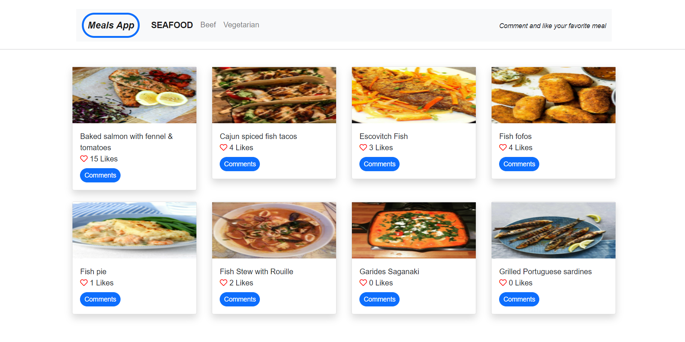

# Meal App

> Meal App is an app that shows 3 different categories of food. In each category there are 6 different meals within that category. Meal DB API provides the data about categories and all the meals. Meal App has homepage and comment modal section. App allows user to like and comment.

Click here for [LIVE DEMO](https://faizi2500.github.io/Meals-App/dist/)

Additional description about the project and its features.

## Built With

- Major languages:
1. ES6/JavaScript
2. HTML
3. CSS
- Technologies used:
1. Git
2. GitHub
3. VS Code
4. Webpack
5. JEST

## Getting Started

To get a local copy up and running follow these simple example steps.

Clone the repo with `git clone git@github.com:faizi2500/Meals-App.git`

Run `npm install` from the command line

Run `npm run build` to get the app up and running.

Run `npm start` to open live server where you can see your changes and avoid repetitive use of `npm run build`

Run `npm test test` to check JEST test results. 

Run `npx hint .` to test for html linting check

Run `npx stylelint "**/*.{css,scss}"` to test for css linting check

Run `npx eslint .` to test for JavaScript Linters. 

The app is deployed using GitHub pages. You can view it using the 'live demo' above.

## Authors

👤 **Faizan Zahid**

- GitHub: [@faizi2500 ](https://github.com/faizi2500)
- Twitter: [@faizi_250 ](https://twitter.com/Faizy_250) 
- LinkedIn: [@faizan2500](www.linkedin.com/in/faizan2500)

👤 **Victor Otieno**

- GitHub: [@vikitaotiz ](https://github.com/vikitaotiz)
- Twitter: [@faizi_250 ](https://twitter.com/Faizy_250) 
- LinkedIn: [@faizan2500](www.linkedin.com/in/faizan2500)

## 🤝 Contributing

Contributions, issues, and feature requests are welcome!

Feel free to check the [issues page](../../issues/).

## Show your support

Give a ⭐️ if you like this project!

## 📝 License

This project is [MIT](./MIT.md) licensed.
